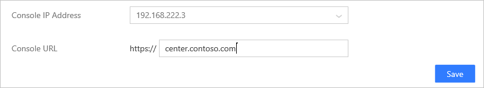

*Gäller för: Advanced Threat Analytics version 1.7*

# Ändra ATA-konfiguration – URL för ATA-konsolen

>[!div class="step-by-step"]
[« ATA Center-certifikat](modifying-ata-config-centercert.md)
[Lösenord för domänanslutning »](modifying-ata-config-dcpassword.md)

## Ändra ATA-konsolens URL
ATA-konsolens URL är som standard den IP-adress som valdes som IP-adress för ATA-konsolen när du installerade ATA Center.

URL:en används i följande scenarier:

-   Installation av ATA-gatewayer – när en ATA-gateway installeras registreras den i ATA Center. Registreringen utförs genom att ansluta till ATA-konsolen. Om du anger ett FQDN som ATA-konsolens URL måste du se till att ATA-gatewayen kan matcha detta FQDN till IP-adressen som ATA-konsolen är bunden till.

-   Aviseringar – när ATA skickar ut en SIEM- eller e-postavisering innehåller den en länk till den misstänkta aktiviteten. Värddelen av länken är URL-inställningen i ATA-konsolen.

-   Om du har installerat ett certifikat från din interna certifikatutfärdare (CA) bör du matcha URL:en till ämnesnamnet i certifikatet så att användarna inte får ett varningsmeddelande när de ansluter till ATA-konsolen.

-   Med ett FQDN som ATA-konsolens URL kan du ändra IP-adressen som används av ATA-konsolen utan att förstöra aviseringar som har skickats tidigare eller behöva ladda ned ATA Gateway-paketet igen. Du behöver bara uppdatera DNS med den nya IP-adressen.

> [!NOTE]
> När du har ändrat ATA-konsolens URL bör du ladda ned installationspaketet för ATA Gateway innan du installerar nya ATA-gatewayer.

Följ de här stegen på ATA Center-servern om du behöver ändra URL för ATA-konsolen.

1.  Öppna ATA-konsolen.

2.  Välj inställningsalternativ i verktygsfältet och välj **Konfiguration**.

    

3.  Välj **Center**.

4.  Under **Konsolens IP-adress**, väljer du någon av de befintliga IP-adresserna

5.  Under **Konsol-URL**, ändra webbadressen efter behov:

    
> [!NOTE]
> Inkludera inte snedstreck / i slutet av URL:en.

6.  Klicka på **Spara**.

>[!div class="step-by-step"]
[« ATA Center-certifikat](modifying-ata-config-centercert.md)
[Lösenord för domänanslutning »](modifying-ata-config-dcpassword.md)

## Se även
- [Arbeta med ATA-konsolen](working-with-ata-console.md)
- [Ta en titt i ATA-forumet!](https://aka.ms/ata-forum)
