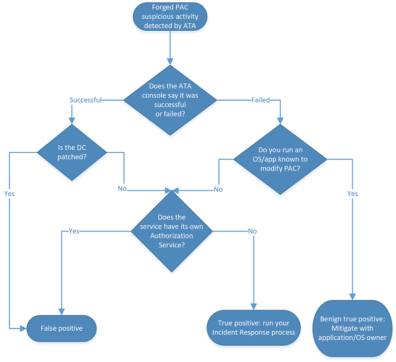

*Gäller för: Advanced Threat Analytics version 1.7*

# Utreda attacker med förfalskat PAC

Microsoft arbetar ständigt för att förbättra säkerhetsfunktioner för identifiering och möjligheten att tillhandahålla värdefull information till säkerhetsanalytiker i nära realtid. Microsoft Advanced Threat Analytics (ATA) är ledande när det gäller de här förbättringarna. Om ATA identifierar en misstänkt aktivitet med ett förfalskat PAC i ditt nätverk och varnar dig om det så får du hjälp med att förstå och undersöka problemet i den här artikeln.

## Vad är ett PAC (Privileged Access Certificate)?

PAC (Privilege Attribute Certificate) är datastrukturen i Kerberos-biljetten som innehåller auktoriseringsinformation, inklusive gruppmedlemskap, säkerhetsidentifierare och användarprofilinformation. I en Active Directory-domän blir det möjligt att skicka auktoriseringsdata som tillhandahålls av domänkontrollanten (DC) till andra medlemsservrar och arbetsstationer för autentisering och auktorisering. Utöver information om medlemskap innehåller PAC även ytterligare autentiseringsinformation, profil- och principinformation samt säkerhetsmetadata som stöds. 

PAC-datastrukturen används av autentiseringsprotokoll (protokoll som verifierar identiteter) för att transportera autentiseringsinformation som styr åtkomst till resurser.

### PAC-verifiering

PAC-verifiering är en säkerhetsfunktion för att hindra angripare från att få obehörig åtkomst till ett system eller dess resurser med ett man-in-the-middle-angrepp, särskilt i program där användarpersonifiering används. Personifiering rör en betrodd identitet, till exempel ett tjänstkonto som har beviljats utökade behörigheter för att komma åt resurser och utföra åtgärder. PAC-verifiering förstärker en säkrare auktoriseringsmiljö i inställningarna för Kerberos-autentisering där personifiering inträffar. [PAC-verifiering](https://blogs.msdn.microsoft.com/openspecification/2009/04/24/understanding-microsoft-kerberos-pac-validation/) ser till att en användare anger exakta auktoriseringsdata, som de är beviljade i Kerberos-biljetten, och att biljettens behörigheter inte har ändrats.

När PAC-verifieringen sker kodar servern ett meddelande med en begäran som innehåller PAC-signaturtypen och längden och skickar den till domänkontrollanten. Domänkontrollanten avkodar begäran och extraherar kontrollsumman för servern och KDC-kontrollsummorna. Om verifieringen av kontrollsumman lyckas returnerar domänkontrollanten returkoden till servern. Ett misslyckad returkod indikerar att PAC har ändrats. 

Innehållet i Kerberos-PAC signeras två gånger: 
- En gång med huvudnyckeln för KDC för att förhindra att skadliga tjänster på serversidan ändrar i auktoriseringsdata
- En gång med huvudnyckeln för kontot på resursservern som är målet för att förhindra användare från att ändra PAC-innehållet och lägga till egna auktoriseringsdata

### PAC-säkerhetsrisk
Säkerhetsbulletinerna [MS14-068](https://technet.microsoft.com/library/security/MS14-068.aspx) och [MS11-013](https://technet.microsoft.com/library/security/ms11-013.aspx) åtgärdar säkerhetsproblem i Kerberos KDC som gör att en angripare kan manipulera PAC-fältet i en giltig Kerberos-biljett, vilket gör att personen kan bevilja sig själv ytterligare behörigheter.

## Attack med förfalskat PAC

En attack med ett förfalskat PAC är ett försök av en angripare att utnyttja dessa säkerhetsproblem för att utöka sina behörigheter i Active Directory-skogen eller domänen. För att utföra angreppet måste angriparen:
-    Ha autentiseringsuppgifterna för en domänanvändare.
-    Ha nätverksanslutning till en domänkontrollant som kan användas för att autentisera mot komprometterade domänautentiseringsuppgifter.
-    Ha de rätta verktygen. Python Kerberos Exploitation Kit (PyKEK) är ett känt verktyg som kan förfalska PAC.

Om angriparen har de nödvändiga autentiseringsuppgifterna och anslutningarna så kan personen ändra eller förfalska PAC (Privileged Access Certificate) för en befintlig Kerberos-användartoken för inloggning (TGT). Angriparen ändrar kravet för gruppmedlemskap så att en grupp med högre privilegier tas med (till exempel ”Domänadministratörer” eller ”Företagsadministratörer”). Angriparen tar sedan med det ändrade PAC-certifikatet i Kerberos-biljetten. Kerberos-biljetten används sedan för att begära en tjänstbiljett från en okorrigerad domänkontrollant som ger angriparen utökade behörigheter i domänen och auktoritet att utföra åtgärder som personen inte ska kunna utföra. En angripare kan använda den ändrade inloggningstoken för användare (TGT) för att få tillgång till alla resurser i domänen genom att begära token för resursåtkomst (TGS). Det innebär att en angripare kan kringgå alla konfigurerade resurs-ACL:er som begränsar åtkomst i nätverket genom att förfalska auktoriseringsdata (PAC) för användarna i Active Directory.

## Identifiera angreppet
När angriparen försöker öka sina privilegier identifieras det av ATA och markeras som en avisering med hög angelägenhetsgrad.

I aviseringen om den misstänkta aktiviteten indikerar ATA om attacken med förfalskat PAC lyckades eller inte. Både aviseringar om lyckade och misslyckade försök bör undersökas eftersom misslyckade försök kan tyda på att en angripare finns i miljön.

## Undersöka
När du har fått aviseringen om attacken med förfalskat PAC i ATA måste du ta reda på vad som behöver göras för att oskadliggöra angreppet. Klassificera först aviseringen som något av följande: 
-    Sann positiv: En skadlig åtgärd som identifierats av ATA
-    Falsk positiv: En inkorrekt avisering – attacken med förfalskat PAC inträffade inte (det här är en händelse som ATA misstog för en attack med förfalskat PAC)
-    Godartad sann positiv: En åtgärd som identifierats av ATA som fungerar som ett hot men som inte är skadlig, till exempel ett genomslagstest

Följande diagram hjälper dig att avgöra hur du ska agera:

1. Kontrollera först aviseringen i attacktidslinjen i ATA för att se om försöket att förfalska auktoriseringen lyckades, misslyckades eller bara var ett försök (attacker som bara är försök är också misslyckade attacker). Både lyckade och misslyckade försök kan leda till sanna positiva försök, men med olika grader av allvarlighet i miljön.
 
 

2.    Om den identifierade attacken med förfalskat PAC lyckades:
    -    Om domänkontrollanten där aviseringen skapades är korrekt uppdaterad är det en falsk positiv händelse. I så fall kan du stänga aviseringen och skicka ett e-postmeddelande till ATA-teamet på ATAEval@microsoft.com så att vi kan fortsätta att förbättra våra identifieringar kontinuerligt. 
    -    Om domänkontrollanten i aviseringen inte är korrekt uppdaterad:
        -    Om tjänsten som anges i aviseringen inte har en egen auktoriseringsmekanism så är det en sann positiv händelse och du bör köra organisationens IR-process. 
        -    Om tjänsten som anges i aviseringen har en intern auktoriseringsmekanism som begär auktoriseringsdata kan den felaktigt identifieras som ett förfalskat PAC. 

3.    Om den identifierade attacken misslyckades:
    -    Om operativsystemet eller programmet kan ändra PAC-certifikatet så är det troligen en godartad sann positiv händelse och du bör arbeta tillsammans med programmets eller operativsystemets ägare för att åtgärda problemet.

    -    Om operativsystemet eller programmet inte kan ändra PAC-certifikatet: 

        -    Om tjänsten som anges inte har en egen auktoriseringstjänst är det en sann positiv händelse och du bör köra organisationens IR-process. Även om angriparen inte lyckades utöka sina privilegier i domänen så kan du utgå från att det finns en angripare i nätverket. Du måste hitta angriparen så snart som möjligt, innan personen försöker utföra andra kända avancerade ihållande attacker för att utöka sina privilegier. 
        -    Om tjänsten som anges i aviseringen har en egen auktoriseringsmekanism som begär auktoriseringsdata kan den felaktigt identifieras som ett förfalskat PAC.

Microsoft rekommenderar att du använder ett professionellt team för incidentsvar och återställning, som kan nås via ditt Microsoft-kontoteam, för att få hjälp med att identifiera om en angripare har distribuerat ihållande metoder i nätverket. Det kan vara via användning av skadlig programvara eller via identitetsöverträdelser, som till exempel stulna autentiseringsuppgifter och gyllene biljetter.

## Se även
- [Arbeta med misstänkta aktiviteter](working-with-suspicious-activities.md)
- [Ändra ATA-konfiguration](modifying-ata-configuration.md)
- [Ta en titt i ATA-forumet!](https://social.technet.microsoft.com/Forums/security/home?forum=mata)
