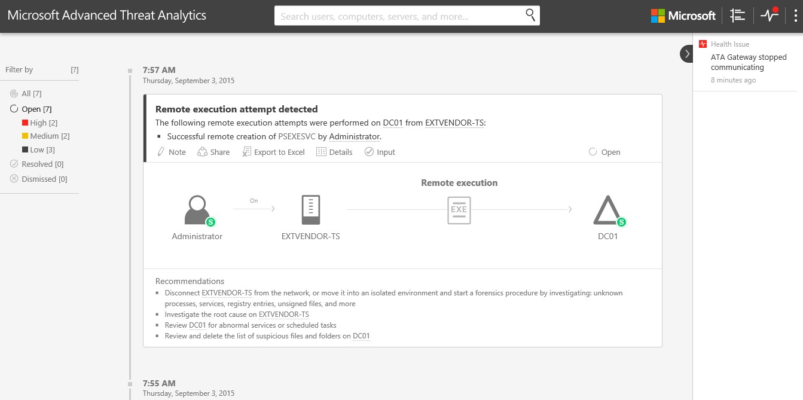

*Gäller för: Advanced Threat Analytics version 1.7*

# Arbeta med misstänkta aktiviteter
Det här avsnittet förklarar grunderna för hur du arbetar med Advanced Threat Analytics.

## Granska misstänkta aktiviteter på attacktidslinjen
När du loggar in på ATA-konsolen kommer du automatiskt till den öppna **tidslinjen med misstänkta aktiviteter**. Misstänkta aktiviteter visas i kronologisk ordning med de senaste misstänkta aktiviteterna längst upp i tidslinjen.
Varje misstänkt aktivitet har följande information:

-   Entiteter som berörs, inklusive användare, datorer, servrar, domänkontrollanter och resurser.

-   Tidpunkter och tidsintervall för de misstänkta aktiviteterna.

-   Allvarlighetsgrad för den misstänkta aktiviteten, Hög, Medel eller Låg.

-   Status: Öppen, löst eller avvisad.

-   Möjlighet att

    -   Dela misstänkta aktiviteter med andra personer i organisationen via e-post.

    -   Exportera den misstänkta aktiviteten till Excel.

    -   Lägga till en anteckning till den misstänkta aktiviteten.

    -   Ange kommentarer om den misstänkta aktiviteten.

-   Innehåller rekommendationer för hur man kan reagera på den misstänkta aktiviteten.

> [!NOTE]
> -   När du håller muspekaren över en användare eller dator visas en entitetsminiprofil som innehåller ytterligare information om entiteten och som innehåller antalet misstänkta aktiviteter som entiteten är kopplad till.
> -   Om du klickar på en entitet kommer du till entitetsprofilen för användaren eller datorn.

## Filtrera lista med misstänkta aktiviteter
Filtrera listan med misstänkta aktiviteter:

1.  I rutan **Filtrera efter** till vänster på skärmen väljer du något av följande: **Alla**, **Öppet**, **Löst** eller **Avvisat**.

2.  Om du vill filtrera listan ytterligare väljer du **Hög**, **Medel** eller **Låg**.

**Allvarlighetsgrad för misstänkt aktivitet**

-   **Låg**

    Visar misstänkta aktiviteter som kan leda till attacker som har utformats för att användare eller programvara med skadliga avsikter ska få åtkomst till organisationsdata.

-   **Medel**

    Visar misstänkta aktiviteter som kan utsätta vissa identiteter för risk för mer allvarliga attacker som kan leda till identitetsstöld eller eskalering av privilegier

-   **Hög**

    Visar misstänkta aktiviteter som kan leda till identitetsstöld, eskalering av privilegier eller andra attacker med stor effekt

**Status för misstänkt aktivitet**

-   **Öppna**

    Alla nya misstänkta aktiviteter visas i den här listan

-   **Matchat**

    Används för att spåra misstänkta aktiviteter som du har identifierat, undersökt och åtgärdat för begränsade.

    > [!NOTE]
    > ATA kan öppna en löst aktivitet igen om samma aktivitet identifieras igen under en kort tidsperiod.

-   **Avvisat**

    Är aktiviteter som du har avvisat manuellt. Om ATA identifierar en liknande misstänkt aktivitet skapas en ny identifiering.

## Ange kommentarer om en misstänkt aktivitet
Om du vill göra det möjligt för ATA att lära sig om nätverket med dig kan vissa misstänkta aktiviteter (DNS-rekognosering, Pass the Ticket, SMB-sessionsuppräkning, onormalt beteende och fjärrkörning) begära kommentarer från dig för att förbättra identifieringen av misstänkta aktiviteter i framtiden.

1.  För misstänkta aktiviteter där du kan ange kommentarer öppnas inmatningsfrågan automatiskt. Du blir ombedd att besvara frågor om aktiviteter i nätverket och huruvida de ska anses som misstänkta. I exemplet nedan tillfrågas du om körning av genomsökningsverktyg är tillåtet från en viss dator.

    

2.  Om du svarar Nej kommer den här aktiviteten att anses som misstänkt och varje gång ATA påträffar aktiviteten från den här datorn visas en varning.

3.  Om du däremot svarar Ja kommer den misstänkta aktiviteten att avvisas och framtida aktiviteter av den här typen från den här datorn kommer kanske inte att generera en misstänkt aktivitet eller så genereras en aktivitet som avvisas automatiskt.

4.  Om du inte vet kan du klicka på **Avbryt**.

## Ändra status för en misstänkt aktivitet
Du kan ändra status för en misstänkt aktivitet genom att klicka på den misstänkta aktivitetens aktuella status och välja något av följande: **Öppet**, **Löst** eller **Avvisat**.

## Se även
- [Ta en titt i ATA-forumet!](https://social.technet.microsoft.com/Forums/security/home?forum=mata)
- [Arbeta med identifieringsinställningar i ATA](working-with-detection-settings.md)
- [Ändra ATA-konfiguration](modifying-ata-configuration.md)

<!--HONumber=Aug16_HO5-->

