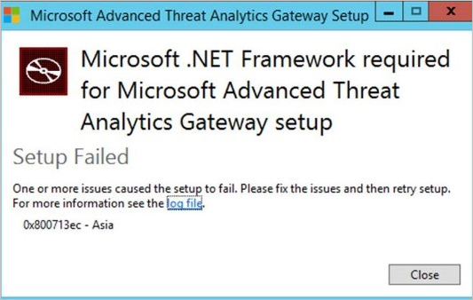

---
# required metadata

title: Felsöka ATA-felloggen | Microsoft Advanced Threat Analytics
description: Beskriver hur du kan felsöka vanliga fel i ATA 
keywords:
author: rkarlin
manager: stevenpo
ms.date: 04/28/2016
ms.topic: article
ms.prod: identity-ata
ms.service: advanced-threat-analytics
ms.technology: security
ms.assetid: d89e7aff-a6ef-48a3-ae87-6ac2e39f3bdb

# optional metadata

#ROBOTS:
#audience:
#ms.devlang:
ms.reviewer: bennyl
ms.suite: ems
#ms.tgt_pltfrm:
#ms.custom:

---

# Felsöka ATA-felloggen
Det här avsnittet beskriver möjliga fel i distributionen av ATA och de steg som krävs för att felsöka dem.
## ATA Gateway-fel
|Fel|Beskrivning|Lösning|
|-------------|----------|---------|
|System.DirectoryServices.Protocols.LdapException: Ett lokalt fel uppstod|ATA Gateway kunde inte autentiseras mot domänkontrollanten.|1. Bekräfta att domänkontrollantens DNS-post har konfigurerats korrekt i DNS-servern.  2. Kontrollera att tiden för ATA Gateway har synkroniserats med tiden för domänkontrollanten.|
|System.IdentityModel.Tokens.SecurityTokenValidationException: Kunde inte verifiera certifikatkedja|ATA Gateway kunde inte verifiera certifikatet för ATA Center.|1. Kontrollera att certifikatet från rotcertifikatutfärdaren har installerats i certifikatarkivet för betrodd certifikatutfärdare på ATA Gateway.  2. Verifiera att listan över återkallade certifikat (CRL) är tillgänglig och att det går att utföra verifiering av certifikatåterkallning.|
|Microsoft.Common.ExtendedException: Det gick inte att tolka skapad tid|ATA Gateway kunde inte tolka syslog-meddelanden som vidarebefordrades från SIEM.|Kontrollera att SIEM har konfigurerats för att vidarebefordra meddelandena i något av de format som stöds av ATA.|
|System.ServiceModel.FaultException: Ett fel uppstod vid verifiering av säkerheten för meddelandet.|ATA Gateway kunde inte autentiseras mot ATA Center.|Kontrollera att tiden för ATA Gateway har synkroniserats med tiden för ATA Center.|
|System.ServiceModel.EndpointNotFoundException: Det gick inte att ansluta till net.tcp://center.ip.addr:443/IEntityReceiver|ATA Gateway kunde inte upprätta en anslutning till ATA Center.|Kontrollera att nätverksinställningarna är korrekta och att nätverksanslutningen mellan ATA Gateway och ATA Center är aktiv.|
|System.DirectoryServices.Protocols.LdapException: LDAP-servern är inte tillgänglig.|ATA Gateway kunde inte skicka en fråga till domänkontrollanten med LDAP-protokollet.|1. Kontrollera att användarkontot som används av ATA för att ansluta till Active Directory-domänen har läsbehörighet för alla objekt i Active Directory-trädet.  2. Kontrollera att domänkontrollanten inte är i strikt läge för att förhindra LDAP-frågor från det användarkonto som används av ATA.|
|Microsoft.Tri.Infrastructure.ContractException: Kontraktundantag|ATA Gateway kunde inte synkronisera konfigurationen från ATA Center.|Slutför konfigurationen av ATA Gateway i ATA-konsolen.|
|System.Reflection.ReflectionTypeLoadException: Det gick inte att läsa in en eller flera av de begärda typerna. Hämta egenskapen LoaderExceptions för mer information.|Message Analyzer har installerats på ATA Gateway.| Avinstallera Message Analyzer.|
|Error [Layout] System.OutOfMemoryException: Undantag av typen ”System.OutOfMemoryException” uppstod.|ATA Gateway har inte tillräckligt med minne.|Öka mängden minne på domänkontrollanten.|
|Kunde inte starta livekonsumenten  ---> Microsoft.Opn.Runtime.Monitoring.MessageSessionException: PEFNDIS-händelseprovidern är inte redo|PEF (Message Analyzer) har inte installerats korrekt.|Kontakta supporten för en lösning.|
|Installationen misslyckades med felet: 0x80070652|Det finns andra väntande installationer på datorn.|Vänta tills de andra installationerna har slutförts och starta om datorn vid behov.|

## ATA-konsolfel
|Fel|Beskrivning|Lösning|
|-------------|----------|---------|
|HTTP-fel 500.19 – internt serverfel|IIS URL-modulen för omarbetning installerades inte korrekt.|Avinstallera och installera om IIS-URL-modulen för omarbetning. [Hämta IIS-URL-modulen för omarbetning](http://go.microsoft.com/fwlink/?LinkID=615137)|

## Distributionsfel
|Fel|Beskrivning|Lösning|
|-------------|----------|---------|
|Installationen av .Net Framework 4.6.1 misslyckas med fel 0x800713ec|Kraven för .Net Framework 4.6.1 är inte installerade på servern. |Kontrollera att Windows-uppdateringarna [KB2919442](https://www.microsoft.com/en-us/download/details.aspx?id=42135) och [KB2919355](https://support.microsoft.com/en-us/kb/2919355) är installerade på servern innan ATA installeras.|

## Se även
- [Krav för ATA](/advanced-threat-analytics/plan-design/ata-prerequisites)
- [ATA-kapacitetsplanering](/advanced-threat-analytics/plan-design/ata-capacity-planning)
- [Konfigurera händelseinsamling](/advanced-threat-analytics/deploy-use/configure-event-collection)
- [Konfigurera vidarebefordran av Windows-händelser](/advanced-threat-analytics/deploy-use/configure-event-collection#ATA_event_WEF)
- [Ta en titt i ATA-forumet!](https://social.technet.microsoft.com/Forums/security/en-US/home?forum=mata)

<!--HONumber=May16_HO4-->

