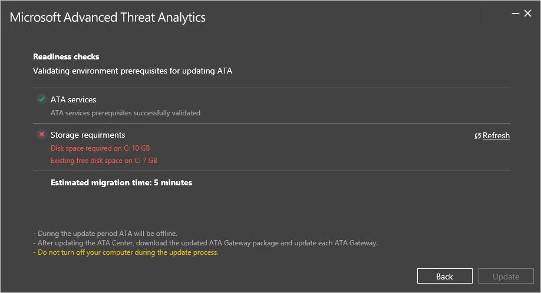

# Nyheter i ATA version 1.6
Dessa versionsanmärkningar innehåller information om kända problem i denna version av Advanced Threat Analytics.

## Vad är nytt i ATA 1.6-uppdateringen?
Uppdateringen för ATA 1.6 ger förbättringar inom följande områden:

-   Nya identifieringar

-   Förbättringar av befintliga identifieringar

-   ATA Lightweight Gateway

-   Automatiska uppdateringar

-   Förbättrad prestanda för ATA Center

-   Lägre lagringskrav

-   Stöd för IBM QRadar

### Nya identifieringar

- **Skadlig privat informationsbegäran för dataskydd** API för dataskydd (DPAPI) är en lösenordsbaserad dataskyddstjänst. Den här skyddstjänsten används av olika program som lagrar användarens hemligheter, t.ex. webbplatslösenord och autentiseringsuppgifter för filresurser. I syfte att ge stöd för scenarier med förlorat lösenord kan användare kryptera data med hjälp av en återställningsnyckel som inte omfattar lösenordet. I en domänmiljö kan angripare stjäla återställningsnyckeln fjärranslutet och använda den för att dekryptera skyddade data i alla domänanslutna datorer.

- **Nettosessionsuppräkning** Rekognosering är ett viktigt steg i den avancerade attackkedjan. Domänkontrollanter (DC) fungerar som filservrar för distribution av grupprincipobjekt som använder SMB-protokollet (Server Message Block). Som en del av rekognoseringsfasen kan angripare fråga DC om alla aktiva SMB-sessioner på servern och ge dem åtkomst till alla användare och IP-adresser som är kopplade till dessa SMB-sessioner. SMB-sessionsuppräkningen kan användas av angripare för rikta in sig på känsliga konton, vilket hjälper dem att flyttas i sidled över nätverket.

- **Skadliga replikeringsbegäranden** I Active Directory-miljöer (AD) sker replikering regelbundet mellan domänkontrollanter. En angripare kan imitera en Active Directory-replikeringsbegäran (ibland genom att utge sig för att vara domänkontrollant) vilket gör det möjligt för angriparen att hämta data som finns lagrad i Active Directory, inklusive lösenordshashvärden, utan att använda mer påträngande tekniker som Volume Shadow Copy.

- **Identifiering av MS11-013-säkerhetsproblem** Det finns en säkerhetsrisk för privilegier i Kerberos som gör det möjligt att förfalska vissa aspekter av en Kerberos-tjänstbiljett. En obehörig användare eller angripare som utnyttjar denna säkerhetsrisk kan hämta en token med högre behörighet på domänkontrollanten.

- **Onormal protokollimplementering** Autentiseringsbegäranden (Kerberos eller NTLM) utförs vanligtvis med en standarduppsättning metoder och protokoll. För att kunna autentisera måste dock begäran endast uppfylla en specifik kravuppsättning. Angripare kan implementera dessa protokoll med mindre avvikelser från standardimplementeringen i miljön. Dessa avvikelser kan tyda på att det finns en angripare som försöker köra attacker som Pass-The-Hash, Brute Force med mera.

### Förbättringar av befintliga identifieringar
ATA 1.6 omfattar förbättrad identifieringslogik som minskar scenarier med falska positiva och falska negativa identifieringar för befintliga identifieringar som Golden Ticket, Honey Token, Brute Force och fjärrkörning.

### ATA Lightweight Gateway
Den här versionen av ATA inför ett nytt distributionsalternativ för ATA Gateway, vilket gör att en ATA Gateway installeras direkt på domänkontrollanten. Det här distributionsalternativet tar bort ej kritiska funktioner från ATA Gateway och inför dynamisk resurshantering baserat på tillgängliga resurser på domänkontrollanten, vilket säkerställer att domänkontrollantens befintliga drift inte påverkas. ATA Lightweight Gateway minskar kostnaden för ATA-distribution. Samtidigt underlättar den distribution på avdelningskontor där det finns begränsad kapacitet hos maskinvaruresurser eller oförmåga att konfigurera stöd för portspegling.
Mer information om ATA Lightweight Gateway finns i [ATA-arkitektur](/advanced-threat-analytics/plan-design/ata-architecture#ata-gateway-and-ata-lightweight-gateway)

Mer information om överväganden vid distribution och att välja rätt typ av gatewayer finns [ATA-kapacitetsplanering](/advanced-threat-analytics/plan-design/ata-capacity-planning#choosing-the-right-gateway-type-for-your-deployment)

### Automatiska uppdateringar
Från och med version 1.6 är det möjligt att uppdatera ATA Center med Microsoft Update. Dessutom kan ATA-gatewayer nu uppdateras automatiskt med hjälp av sina standardkommunikationskanaler till ATA Center.
### Förbättrad prestanda för ATA Center
Med den här versionen gör en lättare databasbelastning och ett mer effektivt sätt att köra all identifiering att många fler domänkontrollanter kan övervakas med ett enda ATA Center.

### Lägre lagringskrav
ATA 1.6 kräver avsevärt mindre lagringsutrymme för att köra ATA-databasen, som nu endast kräver 20 % av det lagringsutrymme som användes i tidigare versioner.

### Stöd för IBM QRadar
ATA kan nu ta emot händelser från IBM:s QRadar SIEM-lösning, utöver de SIEM-lösningar som det fanns stöd för tidigare.

## Kända problem
Följande kända problem finns i den här versionen.

### Det gick inte att identifiera ny sökväg i databaser som har flyttats manuellt

I distributioner där databassökvägen har flyttats manuellt använder inte ATA-distributionen den nya databassökvägen för uppdateringen. Detta kan orsaka följande problem:

- ATA kan använda alla ledigt utrymme på systemenheten för ATA Center, utan att ta bort gamla nätverksaktiviteter cirkulärt.

- Uppdatering av ATA till version 1.6 kan misslyckas med beredskapskontrollerna före uppdatering, på det sätt som visas i bilden nedan.
    
    >[!Important]
Innan du uppdaterar ATA till version 1.6 uppdaterar du följande registernyckel med rätt databassökväg:  `HKEY_LOCAL_MACHINE\SOFTWARE\Microsoft\Microsoft Advanced Threat Analytics\Center\DatabaseDataPath`

### Migreringsfel vid uppdatering från ATA 1.5
Vid uppdatering till ATA 1.6 kan uppdateringen misslyckas med följande felkod:

 Om du ser detta fel granskar du distributionsloggen i: **C:\Users\<User>\AppData\Local\Temp** och letar efter följande undantag:

    System.Reflection.TargetInvocationException: Exception has been thrown by the target of an invocation. ---> MongoDB.Driver.MongoWriteException: A write operation resulted in an error. E11000 duplicate key error index: ATA.UniqueEntityProfile.$_id_ dup key: { : "<guid>" } ---> MongoDB.Driver.MongoBulkWriteException`1: A bulk write operation resulted in one or more errors.  E11000 duplicate key error index: ATA.UniqueEntityProfile.$_id_ dup key: { : " <guid> " }

Du kan också se felet: System.ArgumentNullException: Värdet får inte vara null.
    
Om du ser något av dessa fel kör du följande lösning.

**Lösning**: 

1.  Flytta mappen "data_old" till en tillfällig mapp (finns normalt i %ProgramFiles%\Microsoft Advanced Threat Analytics\Center\MongoDB\bin).
2.  Avinstallera ATA Center v1.5 och ta bort alla databasdata.

3.  Installera om ATA Center v1.5. Se till att använda samma konfiguration som den tidigare installationen av ATA 1.5 (certifikat, IP-adresser, databassökväg osv.).
4.  Stoppa tjänsterna i följande ordning:
    1.  Microsoft Advanced Threat Analytics Center
    2.  MongoDB
5.  Ersätt MongoDB-databasfilerna med filerna i mappen "data_old".
6.  Starta dessa tjänster i följande ordning:
    1.  MongoDB
    2.  Microsoft Advanced Threat Analytics Center
7.  Granska loggarna om du vill verifiera att produkten körs utan fel.
8.  [Hämta](http://aka.ms/ataremoveduplicateprofiles "Hämta") verktyget "RemoveDuplicateProfiles.exe" och kopiera det till den huvudsakliga installationssökvägen (%ProgramFiles%\Microsoft Advanced Threat Analytics\Center)
9.  Kör "RemoveDuplicateProfiles.exe" från en upphöjd kommandotolk och vänta tills den har slutförts.
10. Skriv följande kommando härifrån:  …\Microsoft Advanced Threat Analytics\Center\MongoDB\bin directory: **Mongo ATA**:

    db.SuspiciousActivities.remove({ "_t" : "RemoteExecutionSuspiciousActivity", "DetailsRecords" : { "$elemMatch" : { "ReturnCode" : null } } }, { "_id" : 1 });

Detta bör returnera en WriteResult({ "nRemoved" : XX }) där ”XX” är antalet misstänkta aktiviteter som har tagits bort. Om antalet är större än 0 avslutar du kommandotolken och fortsätter med uppdateringsprocessen.

### NET Framework 4.6.1 kräver att servern startas om

I vissa fall kan installationen av .Net Framework 4.6.1 kräva att du startar om servern. Tänk på att om du klickar på OK i dialogrutan **Installation av Microsoft Advanced Threat Analytics Center** startas servern om automatiskt. Detta är särskilt viktigt när du installerar ATA Lightweight Gateway på en domänkontrollant, eftersom du kanske vill planera en underhållsperiod före installationen.
    

### Historiska nätverksaktiviteter migreras inte längre
Den här versionen av ATA ger en förbättrad identifieringsmotor, som ger mer exakt identifiering och minskar många falska positiva scenarier, särskilt för Pass-the-Hash.
Den nya och förbättrade identifieringsmotorn använder teknik för infogad identifiering, vilket möjliggör identifiering utan att få åtkomst till historisk nätverksaktivitet, så att prestanda för ATA Center ökas avsevärt. Det innebär också att det inte är nödvändigt att migrera historisk nätverksaktivitet under uppdateringsprocessen.
Uppdateringsprocessen för ATA exporterar data, om du vill ha den för framtida undersökningar, till `
\Migration` som en JSON-fil.

## Se även
[Ta en titt i ATA-forumet!](https://social.technet.microsoft.com/Forums/security/home?forum=mata)

[Uppdatera ATA till version 1.6 – migreringsguide](ata-update-1.6-migration-guide.md)

<!--HONumber=Nov16_HO3-->

