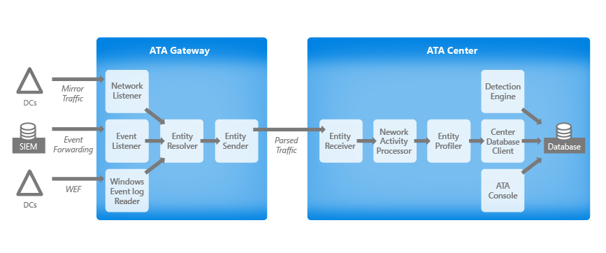

*Gäller för: Advanced Threat Analytics version 1.9.*

# ATA-arkitektur
Arkitekturen för Advanced Threat Analytics beskrivs i det här diagrammet:

ATA övervakar nätverkstrafiken på dina domänkontrollanter genom att använda portspegling mot en ATA-gateway med fysiska eller virtuella växlar. Om du distribuerar ATA Lightweight Gateway direkt på domänkontrollanterna krävs inte portspegling. Dessutom kan ATA utnyttja Windows-händelser (vidarebefordras direkt från domänkontrollanterna eller en SIEM-server) och analysera data beträffande attacker och hot.
Det här avsnittet beskriver nätverkstrafik- och händelseinsamlingsflödet samt huvudkomponenterna i ATA: ATA Gateway, ATA Lightweight Gateway (som har samma grundfunktioner som ATA Gateway) och ATA Center.

## ATA-komponenter
ATA består av följande komponenter:

-   **ATA Center**  
ATA Center tar emot data från ATA-gatewayer och/eller ATA Lightweight-gatewayer som du distribuerar.
-   **ATA Gateway** 
ATA Gateway installeras på en dedikerad server som övervakar trafiken från domänkontrollanterna med antingen portspegling eller en nätverks-TAP.
-   **ATA Lightweight Gateway** 
ATA Lightweight Gateway installeras direkt på domänkontrollanterna och övervakar trafiken direkt, utan att behöva en dedikerad server eller konfiguration av portspegling. Det är ett alternativ till ATA Gateway.

En ATA-distribution kan bestå av ett enda ATA Center som är anslutet till alla ATA-gatewayer, alla ATA Lightweight-gatewayer eller en kombination av ATA-gatewayer och ATA Lightweight-gatewayer.

## Distributionsalternativ
Du kan distribuera ATA med följande kombination av gatewayer:

-   **Endast med ATA Gateway**  
ATA-distributionen kan innehålla endast ATA-gatewayer, utan några ATA Lightweight-gatewayer: Alla domänkontrollanter måste konfigureras för portspegling mot en ATA-gateway, alternativt krävs nätverks-TAP.
-   **Endast med ATA Lightweight Gateway** 
ATA-distributionen kan innehåller endast ATA Lightweight-gatewayer: ATA Lightweight-gatewayerna distribueras på varje domänkontrollant och inga ytterligare servrar eller konfiguration av portspegling krävs.
-   **Med både ATA Gateway och ATA Lightweight Gateway** 
ATA-distributionen omfattar både ATA-gatewayer och ATA Lightweight-gatewayer. ATA Lightweight-gatewayerna installeras på vissa av dina domänkontrollanter (till exempel alla domänkontrollanter på dina förgreningsplatser). Samtidigt övervakas andra domänkontrollanter av ATA-gatewayer (till exempel de större domänkontrollanterna på huvuddatacenter).

I alla dessa scenarier skickar alla gatewayer sina data till ATA Center.

## ATA Center
**ATA Center** utför följande funktioner:

-   Hanterar konfigurationsinställningar för ATA Gateway och ATA Lightweight Gateway

-   Tar emot data från ATA-gatewayer och ATA Lightweight-gatewayer 

-   Identifierar misstänkta aktiviteter

-   Kör ATA-maskininlärningsalgoritmer för beteende för att upptäcka onormalt beteende

-   Kör olika deterministiska algoritmer för att identifiera avancerade attacker baserat på attackkedjan

-   Kör ATA-konsolen

-   Valfritt: ATA Center kan konfigureras för att skicka e-post och händelser när en misstänkt aktivitet upptäcks.

ATA Center tar emot parsad trafik från ATA Gateway och ATA Lightweight Gateway. Därefter genomför tjänsten profilering, kör deterministisk identifiering, och kör maskininlärnings- och beteendealgoritmer för att lära sig om ditt nätverk, identifierar avvikelser samt varnar dig för misstänkta aktiviteter.

|||
|-|-|
|Entitetsmottagare|Tar emot grupper med entiteter från alla ATA-gatewayer och ATA Lightweight-gatewayer.|
|Nätverksaktivitetsprocessor|Bearbetar alla nätverksaktiviteter inom varje grupp som tas emot. Till exempel utförs matchning mellan de olika Kerberos-stegen från potentiellt olika datorer|
|Entitetsprofilerare|Profilerar alla unika entiteter enligt trafik och händelser. Till exempel uppdaterar ATA listan över inloggade datorer för varje användarprofil.|
|Centerdatabas|Hanterar skrivprocessen för nätverksaktiviteter och händelser till databasen. |
|Databas|ATA använder MongoDB för lagring av alla data i systemet:  – Nätverksaktiviteter – Händelseaktiviteter – Unika entiteter – Misstänkta aktiviteter – ATA-konfiguration|
|Detektorer|Detektorerna använder maskininlärningsalgoritmer och deterministiska regler för att hitta misstänkta aktiviteter och onormalt användarbeteende i nätverket.|
|ATA-konsolen|ATA-konsolen används för att konfigurera ATA och övervaka misstänkta aktiviteter som identifieras av ATA i nätverket. ATA-konsolen är inte beroende av ATA Center-tjänsten och körs även om tjänsten har stoppats, förutsatt att den kan kommunicera med databasen.|
Tänk på följande när du bestämmer hur många ATA Center som ska distribueras i nätverket:

-   Ett ATA Center kan övervaka en enda Active Directory-skog. Om du har fler än en Active Directory-skog behöver du minst ett ATA Center per Active Directory-skog.

-    I stora Active Directory-distributioner kanske inte ett enda ATA Center kan hantera all trafik på alla domänkontrollanter. I så fall krävs flera ATA Center. Antalet ATA Center bör avgöras genom [ATA-kapacitetsplanering](ata-capacity-planning.md).

## ATA Gateway och ATA Lightweight Gateway

### Grundläggande funktioner för gateway
**ATA Gateway** och **ATA Lightweight Gateway** har båda samma grundläggande funktioner:

-   Samla in och inspektera nätverkstrafik på domänkontrollanter. Det här är portspeglad trafik för ATA-gatewayer och lokal trafik för domänkontrollanten i ATA Lightweight-gatewayer. 

-   Ta emot Windows-händelser från SIEM- eller Syslog-servrar eller från domänkontrollanter med hjälp av vidarebefordran av Windows-händelser

-   Hämta information om användare och datorer från Active Directory-domänen

-   Matcha nätverksentiteter (användare, grupper och datorer)

-   Överföra relevanta data till ATA Center

-   Övervaka flera domänkontrollanter från en enda ATA Gateway eller övervaka en enskild domänkontrollant för ATA Lightweight Gateway.

ATA Gateway tar emot nätverkstrafik och Windows-händelser från nätverket och bearbetar dessa i följande huvudkomponenter:

|||
|-|-|
|Nätverkslyssnare|Nätverkslyssnaren samlar in nätverkstrafik och parsar trafiken. Den här aktiviteten kräver mycket processorkraft, så det är särskilt viktigt att kontrollera [Krav för ATA](ata-prerequisites.md) när du planerar för ATA Gateway och ATA Lightweight Gateway.|
|Händelselyssnare|Händelselyssnaren samlar in och parsar Windows-händelser som vidarebefordras från en SIEM-server i ditt nätverk.|
|Windows händelseloggläsare|Windows-händelseloggläsaren läser och parsar Windows-händelser som vidarebefordras till ATA-gatewayens Windows-händelselogg från domänkontrollanterna.|
|Nätverksaktivitetsöversättare | Översätter tolkad trafik till en logisk återgivning av trafiken som används av ATA (NetworkActivity).
|Entitetslösaren|Entitetslösaren tar tolkade data (nätverkstrafik och händelser) och löser dessa data med Active Directory för att hitta konto- och identitetsinformation. Den matchas sedan mot IP-adresser som finns i tolkade data. Entitetslösaren granskar paketrubriker på ett effektivt sätt för att möjliggöra tolkning av autentiseringspaket för datornamn, egenskaper och identiteter. Entitetslösaren kombinerar tolkade autentiseringspaket med data i det faktiska paketet.|
|Entitetssändare|Entitetssändaren skickar parsade och matchade data till ATA Center.|

## Funktioner för ATA Lightweight Gateway

Följande funktioner fungerar på olika sätt beroende på om du kör ATA Gateway eller ATA Lightweight Gateway.

-   ATA Lightweight Gateway kan läsa händelser lokalt, utan att du behöver konfigurera vidarebefordran av händelser.

-   **Kandidat för domänsynkronisering** 
Domänsynkroniseringsgateway ansvarar för att proaktivt synkronisera alla entiteter från en specifik Active Directory-domän (liknar mekanismen som används av själva domänkontrollanterna för replikering). En gateway väljs slumpmässigt från listan över kandidater för att fungera som domänsynkroniserare.   
Om synkroniseraren är offline i mer än 30 minuter väljs en annan kandidat i stället. Om det finns någon domänsynkroniserare tillgänglig för en specifik domän, är ATA synkronisera entiteter och deras ändringar proaktivt men ATA kan reaktivt hämta nya entiteter när de hittas i övervakad trafik. 
 Om det inte finns någon domänsynkroniserare, och du söker efter en entitet som inte har någon trafik relaterad till den, visas inga sökresultat.  
Som standard är alla ATA-gatewayer synkroniseringskandidater.  
Eftersom alla ATA Lightweight-gatewayer mer troligt distribueras på avdelningskontor och på små domänkontrollanter är de som standard inte synkroniseringskandidater.

-   **Resursbegränsningar** 
ATA Lightweight Gateway innehåller en övervakningskomponent som utvärderar den tillgängliga kapaciteten för beräknings- och minneskapaciteten på den domänkontrollant där den körs. Övervakningsprocessen körs var 10:e sekund och uppdaterar dynamiskt processor- och minnesanvändningskvoten på ATA Lightweight Gateway-processen för att se till att domänkontrollanten vid varje given tidpunkt har minst 15 % lediga beräknings- och minnesresurser.  
Oavsett vad som händer på domänkontrollanten frigör den här processen alltid resurser för att se till att domänkontrollantens grundläggande funktioner inte påverkas.  
Om detta orsakar ATA Lightweight Gateway får slut på resurser övervakas endast delar av trafiken och den övervakning aviseringen ”bort portspeglad nätverkstrafik” visas på hälsosidan.

Följande tabell innehåller ett exempel på en domänkontrollant med tillräckligt med beräkningsresurser tillgängliga som möjliggör en större kvot än vad som krävs för närvarande, så att all trafik övervakas:

> [!div class="mx-tableFixed"]
||||||
|-|-|-|-|-|
|Active Directory (Lsass.exe)|ATA Lightweight Gateway (Microsoft.Tri.Gateway.exe)|Diverse (andra processer) |Kvot för ATA Lightweight Gateway|Släppt av gateway|
|30 %|20 %|10 %|45 %|Nej|

Om Active Directory behöver mer beräkning minskas kvoten som krävs av ATA Lightweight Gateway. I följande exempel behöver ATA Lightweight Gateway mer än den tilldelade kvoten och släpper en del av trafiken (övervakar endast delvis trafik):

> [!div class="mx-tableFixed"]
||||||
|-|-|-|-|-|
|Active Directory (Lsass.exe)|ATA Lightweight Gateway (Microsoft.Tri.Gateway.exe)|Diverse (andra processer) |Kvot för ATA Lightweight Gateway|Släpper gateway|
|60 %|15 %|10 %|15 %|Ja|

## Dina nätverkskomponenter
Se till att kontrollera att följande komponenter har ställts in för att arbeta med ATA.

### Portspegling
Om du använder ATA-gatewayer behöver du konfigurera portspegling för de domänkontrollanter som övervakas och ange ATA Gateway som mål med hjälp av de fysiska eller virtuella växlarna. Ett annat alternativ är att använda nätverks-TAP. ATA fungerar om vissa men inte alla domänkontrollanter övervakas, men identifieringar är mindre effektiva.

Även om portspegling speglar all domänkontrollantstrafik till ATA Gateway är endast en liten andel av denna trafik som sedan skickas i komprimerat format till ATA Center för analys.

Domänkontrollanterna och ATA-gatewayerna kan vara fysiska eller virtuella, mer information finns i [Konfigurera portspegling](configure-port-mirroring.md).

### händelser
Om du vill förbättra ATA-identifieringen av Pass-the-Hash, Brute Force, Ändring av känsliga grupper och Honey tokens behöver ATA följande Windows-händelser: 4776, 4732, 4733, 4728, 4729, 4756, 4757. Dessa kan antingen läsas automatiskt av ATA Lightweight Gateway eller, om ATA Lightweight Gateway inte har distribuerats, vidarebefordras till ATA Gateway på något av två sätt genom att ATA Gateway konfigureras att lyssna efter SIEM-händelser eller genom att [vidarebefordran av Windows-händelser konfigureras](#configuring-windows-event-forwarding).

-   Konfigurera ATA Gateway för att lyssna efter SIEM-händelser  Konfigurera SIEM för att vidarebefordra specifika Windows-händelser till ATA. ATA har stöd för ett antal SIEM-leverantörer. Mer information finns i [Konfigurera händelseinsamling](configure-event-collection.md).

-   Konfigurera vidarebefordran av Windows-händelser Du kan också ATA kan även hämta händelser genom att konfigurera domänkontrollanterna så att de vidarebefordrar Windows-händelser 4776, 4732, 4733, 4728, 4729, 4756 och 4757 till ATA Gateway. Det här är särskilt användbart om du inte har en SIEM eller om din SIEM för närvarande inte stöds av ATA. Mer information om vidarebefordran av Windows-händelser i ATA finns i [Konfigurera vidarebefordran av Windows-händelser](configure-event-collection.md#configuring-windows-event-forwarding). Detta gäller endast för fysisk ATA-gatewayer - inte till ATA Lightweight Gateway.

## Relaterade videor
- [Välja rätt ATA Gateway-typ](https://channel9.msdn.com/Shows/Microsoft-Security/ATA-Deployment-Choose-the-Right-Gateway-Type)

## Se även
- [Krav för ATA](ata-prerequisites.md)
- [ATA-storleksverktyget](http://aka.ms/atasizingtool)
- [ATA-kapacitetsplanering](ata-capacity-planning.md)
- [Konfigurera händelseinsamling](configure-event-collection.md)
- [Konfigurera vidarebefordran av Windows-händelser](configure-event-collection.md#configuring-windows-event-forwarding)
- [Ta en titt i ATA-forumet!](https://social.technet.microsoft.com/Forums/security/home?forum=mata)

