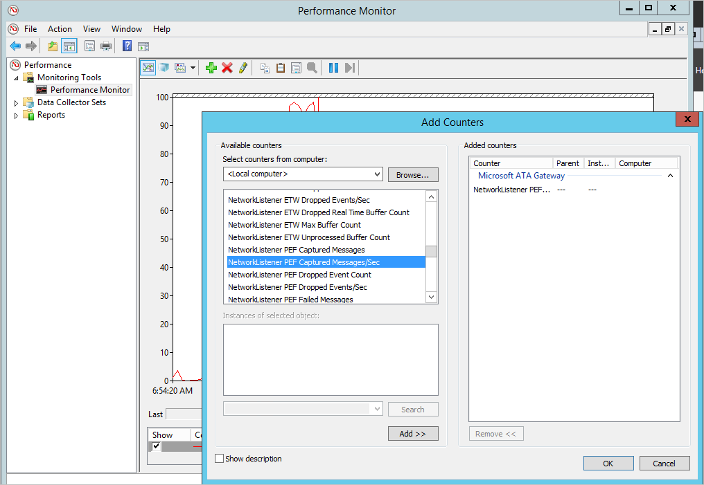

*Gäller för: Advanced Threat Analytics version 1.9.*

# Installera ATA – Steg 5

>[!div class="step-by-step"]
[« Steg 4](install-ata-step4.md)
[Steg 6 »](install-ata-step6.md)

## Steg 5. Konfigurera inställningar för ATA Gateway
När ATA Gateway har installerats gör du följande för att konfigurera inställningarna för ATA Gateway.

1.  I ATA-konsolen, gå till **Konfiguration** och under **System**, väljer du **Gateways**.
   
     

2.  Klicka på den gateway som du vill konfigurera och ange följande information:

    

  - **Beskrivning**: Ange en beskrivning av ATA Gateway (valfritt).
  - **Portspeglade domänkontrollanter (FQDN)** (krävs för ATA Gateway, detta kan inte ändras för ATA Lightweight Gateway): Ange fullständig FQDN för domänkontrollanten och klicka på plustecknet för att lägga till den i listan. Till exempel  **dc01.contoso.com**

      Följande information gäller servrar som du anger i listan **Domänkontrollanter**:
      - Alla domänkontrollanter vars trafik övervakas via portspegling av ATA Gateway måste anges i listan **Domänkontrollanter**. Om en domänkontrollant inte visas i listan **Domänkontrollanter** kan det hända att identifiering av misstänkta aktiviteter inte fungerar som förväntat.
      - Minst en domänkontrollant i listan bör vara en global katalog. Detta gör det möjligt för ATA att lösa dator- och användarobjekt i andra domäner i skogen.

  - **Avbilda nätverkskort** (krävs):
  - Välj de nätverkskort som har konfigurerats som målspeglingskort för en ATA Gateway på en dedikerad server. Dessa ta emot speglad domain controller trafik.
  - För en ATA Lightweight Gateway bör detta vara alla nätverkskort som används för kommunikation med andra datorer i organisationen.

  - **Kandidat för domänsynkronisering**: Eventuell ATA Gateway som har konfigurerats som kandidat för domänsynkronisering kan ansvara för synkronisering mellan ATA och Active Directory-domänen. Beroende på domänens storlek på den första synkroniseringen kan ta lite tid och är resurskrävande. Som standard anges endast ATA-gatewayar som kandidater för domänsynkronisering.
   Det rekommenderas att du inaktiverar eventuella fjärranslutna ATA-gatewayer från att vara kandidater för domänsynkronisering.
   Om domänkontrollanten är skrivskyddad ska den inte anges som kandidat för domänsynkronisering. Mer information finns i [ATA-arkitektur](ata-architecture.md#ata-lightweight-gateway-features).

  > [!NOTE] 
  > Det tar några minuter för ATA Gateway-tjänsten att startas första gången efter installation eftersom den bygger upp cache för tolkar för nätverksavbildning.
  > Ändringar i konfigurationen tillämpas på ATA Gateway vid nästa schemalagda synkronisering mellan ATA Gateway och ATA Center.

3. Du kan välja att ange [Syslog listener och Windows Event Forwarding Collection](configure-event-collection.md). 
4. Aktivera **uppdatera ATA Gateway automatiskt** så att med kommande versioner när du uppdaterar ATA Center, ATA-Gateway uppdateras automatiskt.

5. Klicka på **Spara**.

## Verifiera installationer
Om du vill verifiera att ATA Gateway har distribuerats, kontrollerar du följande steg:

1.  Kontrollera att tjänsten **Microsoft Advanced Threat Analytics Gateway** körs. Det kan ta några minuter innan tjänsten startar efter att du har sparat inställningarna för ATA Gateway.

2.  Om tjänsten inte startar kontrollerar du filen ”Microsoft.Tri.Gateway-Errors.log” som finns i följande standardmapp, ”%programfiles%\Microsoft Advanced Threat Analytics\Gateway\Logs” och markerar [ATA-felsökning](troubleshooting-ata-known-errors.md) för hjälp.

3.  Om detta är den första ATA Gateway som installeras bör du efter några minuter logga in på ATA-konsolen och öppna meddelandefönstret genom att svepa på höger sida av skärmen. En lista bör visas med **Senaste inlärda entiteter** i meddelandefältet på höger sida av konsolen.

4.  På skrivbordet klickar du på genvägen för **Microsoft Advanced Threat Analytics** för att ansluta till ATA-konsolen. Logga in med samma autentiseringsuppgifter som du använde för att installera ATA Center.
5.  I konsolen söker du efter något i sökfältet, t.ex. en användare eller grupp på domänen.
6.  Öppna Prestandaövervakaren. I trädet Prestanda klickar du på **Prestandaövervakare** och klickar sedan på plusikonen för att **Lägga till en räknare**. Expandera **Microsoft ATA Gateway** och bläddra ned till **Meddelanden/sek som inhämtats av nätverkslyssnare PEF** och lägg till den. Kontrollera sedan att aktiviteten visas i diagrammet.

    

>[!div class="step-by-step"]
[« Steg 4](install-ata-step4.md)
[Steg 6 »](install-ata-step6.md)

## Relaterade videor
- [Översikt över ATA-distribution](https://channel9.msdn.com/Shows/Microsoft-Security/Overview-of-ATA-Deployment-in-10-Minutes)
- [Välja rätt ATA Gateway-typ](https://channel9.msdn.com/Shows/Microsoft-Security/ATA-Deployment-Choose-the-Right-Gateway-Type)

## Se även
- [ATA POC Distributionsguide](http://aka.ms/atapoc)
- [ATA-storleksverktyget](http://aka.ms/atasizingtool)
- [Ta en titt i ATA-forumet!](https://social.technet.microsoft.com/Forums/security/home?forum=mata)
- [Konfigurera händelseinsamling](configure-event-collection.md)
- [Krav för ATA](ata-prerequisites.md)

