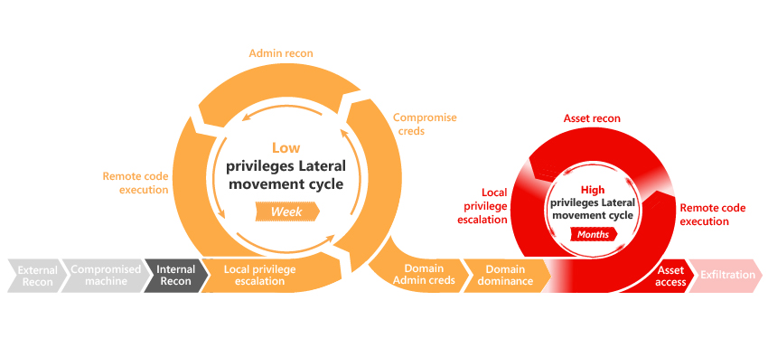

*Gäller för: Advanced Threat Analytics version 1.8*

# Introduktion

ATA ger identifiering för följande olika faser i en avancerad attack: rekognosering, avslöjade autentiseringsuppgifter, lateral förflyttning, eskalering av privilegier, domändominans med mera.

Faser i kill-kedjan där ATA innehåller identifieringar som för närvarande är markerade i det här diagrammet.

Den här artikeln innehåller information om varje misstänkt aktivitet per fas.

## Rekognosering med kontouppräkning

> [!div class="mx-tableFixed"]
|Beskrivning|Undersökning|Rekommendation|Allvarlighetsgrad|
|------|----|------|----------|
| Attacker med kontouppräkning är en teknik som angripare använder för att gissa sig fram till olika kontonamn, med hjälp av Kerberos-autentiseringsförsök, för att ta reda på om en användare finns i nätverket. Konton som identifieras på det här sättet kan användas i efterföljande steg i attacken. | Undersök datorn i fråga och försök avgöra om det finns en bra anledning till varför den startar så många Kerberos-autentiseringsprocesser. Det här är processer som försökte och misslyckades med att identifiera flera konton eftersom användaren inte finns (felet Client_Principal_Unknown), och där minst ett åtkomstförsök lyckades.   **Undantag:** Den här identifieringen letar efter flera konton som inte finns och autentiseringsförsök från samma dator. Om en användare skriver fel när han eller hon manuellt anger ett användarnamn eller en domän, identifieras autentiseringsförsöket som ett försök att logga in på ett konto som inte finns. Terminalservrar som kräver att många användare loggar in kan ha ett stort antal felaktiga inloggningsförsök, utan att det beror på ett intrångsförsök. |Undersök processen som ansvarar för att generera dessa förfrågningar.  Hjälp med att identifiera processer baserat på källport finns i [Have you ever wanted to see which Windows process sends a certain packet out to network?](https://blogs.technet.microsoft.com/nettracer/2010/08/02/have-you-ever-wanted-to-see-which-windows-process-sends-a-certain-packet-out-to-network/) (Vill du veta vilken Windows-process som skickar ut ett visst paket i nätverket?)|Medel|

## Rekognosering med uppräkning av katalogtjänster (SAM-R)

> [!div class="mx-tableFixed"]
|Beskrivning|Undersökning|Rekommendation|Allvarlighetsgrad|
|------|----|------|----------|
irectory services rekognosering är en teknik som används av angripare för att mappa katalogstrukturen och rikta Privilegierade konton för senare steg i angrepp. SAM-R-protokollet (Security Account Manager Remote) är en av metoderna som används för att fråga katalogen. | Ta reda på varför datorn i fråga kör Security Accounts Manager - Remote (MS-SAMR). Detta görs på ett onormalt sätt och antagligen körs frågor mot känsliga entiteter.   **Undantag:** Den här identifieringen baseras på profileringen av det normala beteendet för användare som skickar SAM-R-frågor, och varnar dig när en onormal fråga observeras. Känsliga användare som loggar in på datorer som de inte äger kan utlösa en SAM-R-fråga som identifieras som onormal, även om det är en del av den normala arbetsprocessen. Detta är vanligt för medlemmar i IT-teamet. Om händelsen flaggas som misstänkt, men är resultatet av normal användning, beror det på att beteendet inte tidigare har observerats av ATA. | I detta fall rekommenderar vi en längre inlärningsperiod och bättre täckning av ATA i domänen, per Active Directory-skog.  [Ladda ned och kör verktyget ”SAMRi10”](https://gallery.technet.microsoft.com/SAMRi10-Hardening-Remote-48d94b5b). SAMRi10 gavs ut av ATA-teamet och skyddar din miljö mot SAM-R-frågor. | Medel|

## Rekognosering med DNS

> [!div class="mx-tableFixed"]
|Beskrivning|Undersökning|Rekommendation|Allvarlighetsgrad|
|------|----|------|----------|
| Din DNS-server innehåller en karta över alla datorer, IP-adresser och tjänster i ditt nätverk. Den här informationen används av angripare för att mappa din nätverksinfrastruktur och för att angripa intressanta datorer i efterföljande steg i attacken. | Ta reda på varför datorn i fråga kör en Full Transfer Zone-fråga (AXFR) för att hämta alla poster i DNS-domänen.   **Undantag:** Den här identifieringen identifierar icke-DNS-servrar som skickar DNS-zonöverföringsförfrågningar. Det finns flera säkerhetsgenomsökningslösningar som är kända för att skicka den här typen av förfrågningar till DNS-servrar.   Kontrollera också att ATA kan kommunicera via port 53 från ATA-gatewayerna till DNS-servrarna för att undvika scenarier med falsk positiv identifiering.| Begränsa zonöverföringar genom att noggrant välja vilka värdar som kan begära det. Mer information finns i [Säkra DNS](https://technet.microsoft.com/library/cc770474(v=ws.11).aspx) och [Checklista: Säkra din DNS-server](https://technet.microsoft.com/library/cc770432(v=ws.11).aspx). |Medel|

## Rekognosering med SMB-sessionsuppräkning

> [!div class="mx-tableFixed"]
|Beskrivning|Undersökning|Rekommendation|Allvarlighetsgrad|
|------|----|------|----------|
| Med SMB-uppräkning (Server Message Block) kan en angripare få information om vilka IP-adresser som användare i ditt nätverk nyligen har loggat in från. När en angripare har fått tag i den här informationen kan den användas för att angripa specifika konton och för att flytta i sidled i nätverket. | Ta reda på varför datorn i fråga kör SMB-sessionsuppräkningar.  **Undantag:** Den här identifieringen arbetar under antagandet att SMB-sessionsuppräkningen inte har någon legitim funktion i ett företagsnätverk, men vissa säkerhetsgenomsökningslösningar (till exempel Websense) skickar den här typen av förfrågningar. | [Använd verktyget net cease för att stärka din miljö](https://gallery.technet.microsoft.com/Net-Cease-Blocking-Net-1e8dcb5b) | Medel   |

## Brute-force (LDAP, Kerberos, NTLM)

> [!div class="mx-tableFixed"]
|Beskrivning|Undersökning|Rekommendation|Allvarlighetsgrad|
|------|----|------|----------|
| I en brute-force-attack, eller råstyrkeattack som det också kallas, provar angriparen många lösenord och hoppas att så småningom gissa rätt. Angriparen kontrollerar systematiskt alla möjliga lösenord (eller ett stort antal möjliga lösenord) tills rätt lösenord hittas. När en angripare har gissat sig fram till rätt lösenord kan han eller hon logga in i nätverket som användaren i fråga. ATA stöder för närvarande horisontell (flera konton) brute-force med hjälp av Kerberos- eller NTLM-protokollet och horisontell och vertikal (ett konto, flera lösenordsförsök) brute-force med enkel LDAP-bindning. | Ta reda på varför datorn i fråga inte kan autentisera flera användarkonton (med ungefär samma antal autentiseringsförsök för flera användare) eller varför det finns ett stort antal misslyckade autentiseringsförsök för en enskild användare.   **Undantag:** Den här identifieringen baseras på profileringen av det normala beteendet för konton som autentiserar till olika resurser, och utlöser en avisering när ett onormalt mönster observeras. Det här mönstret är inte ovanligt i skript som autentiserar automatiskt men som kanske använder inaktuella autentiseringsuppgifter (dvs. fel lösenord eller användarnamn). | Komplexa och lång lösenord utgör en nödvändig första säkerhetsnivå mot brute-force-attacker. | Medel   |

## Känsligt konto som exponerats i klartextautentisering och tjänst som exponerar konton i klartextautentisering

> [!div class="mx-tableFixed"]
|Beskrivning|Undersökning|Rekommendation|Allvarlighetsgrad|
|------|----|------|----------|
| Vissa tjänster på en dator skickar autentiseringsuppgifter i klartext, även för känsliga konton. Angripare som övervakar din trafik kan få tag på dessa autentiseringsuppgifter för skadliga syften. Alla lösenord i klartext för ett känsligt konto utlöser aviseringen. | Lokalisera den aktuella datorn och ta reda på varför den använder enkla LDAP-bindningar. | Kontrollera konfigurationen på källdatorerna och se till att du inte använder enkel LDAP-bindning. Använd LDAP SALS eller LDAPS i stället för enkla LDAP-bindningar. Följ Security Tiered Framework och begränsa åtkomsten på de olika nivåerna för att förhindra behörighetseskalering. | Låg för tjänstexponering; Medel för känsliga konton |

## Misstänkt aktivitet för Honung Token-konto

> [!div class="mx-tableFixed"]
|Beskrivning|Undersökning|Rekommendation|Allvarlighetsgrad|
|------|----|------|----------|
| Honey token-konton är attrappkonton som skapas för att fånga, identifiera och spåra skadliga aktiviteter i nätverket där dessa konton används. Det här är konton som inte används och som är vilande i nätverket. Om ett honey token-konto plötsligt uppvisar aktivitet, kan det vara ett tecken på att en illvillig användare försöker använda kontot. | Ta reda på varför ett honey token-konto autentiserar från den här datorn. | Bläddra igenom ATA-profilsidorna för andra känsliga (privilegierade) konton i din miljö för att se om det finns potentiellt misstänkta aktiviteter. | Medel   |

## Onormal protokollimplementering

> [!div class="mx-tableFixed"]
|Beskrivning|Undersökning|Rekommendation|Allvarlighetsgrad|
|------|----|------|----------|
|Angripare kan använda verktyg som implementerar SMB-/Kerberos-protokoll på ett sätt som gör det möjligt för dem att få kontroll över ditt nätverk. Det här är en indikation på skadliga tekniker som används för over-pass-the-hash- eller brute force-attacker. | Ta reda på varför datorn i fråga använder ett autentiseringsprotokoll eller SMB på ett onormalt sätt.   Så här avgör du om det rör sig om en WannaCry-attack:   1.    Ladda ned Excel-exporten av den misstänkta aktiviteten.  2.    Öppna fliken för nätverksaktivitet och gå till fältet ”Json” för att kopiera de relaterade JSON-objekten Smb1SessionSetup och Ntlm  3.   Om Smb1SessionSetup.OperatingSystem är ”Windows 2000 2195” och Smb1SessionSetup.IsEmbeddedNtlm är ”true” och om Ntlm.SourceAccountId är ”null”, så rör det sig om ett WannaCry-angrepp.    **Undantag:** Den här identifieringen kan utlösas i sällsynta fall när legitima verktyg används som inte implementerar protokollen på vanligt sätt. Vissa penetrationstestningsprogram är kända för att göra detta. | Samla in nätverkstrafik och identifiera vilken process som genererar trafik med den onormala protokollimplementeringen.| Medel|

## Skadlig privat informationsbegäran för dataskydd

> [!div class="mx-tableFixed"]
|Beskrivning|Undersökning|Rekommendation|Allvarlighetsgrad|
|------|----|------|----------|
|DPAPI (Data Protection API) används av flera komponenter i Windows för att lagra lösenord, krypteringsnycklar och andra känsliga data på ett säkert sätt. Domänkontrollanter lagrar en reservhuvudnyckel som kan användas för att dekryptera alla hemligheter som krypterats med DPAPI av domänanslutna Windows-datorer. Angripare kan använda reservhuvudnyckeln för DPAPI-domäner för att dekryptera alla hemligheter på alla domänanslutna datorer (lösenord för webbläsare, krypterade filer osv.).| Ta reda på varför datorn har gjort en förfrågan med det här odokumenterade API-anropet för huvudnyckeln för DPAPI.|Mer information om DPAPI finns i avsnittet om [Windows Data Protection](https://msdn.microsoft.com/library/ms995355.aspx).|Hög|

## Misstanke om identitetsstöld baserat på onormalt beteende

> [!div class="mx-tableFixed"]
|Beskrivning|Undersökning|Rekommendation|Allvarlighetsgrad|
|------|----|------|----------|
| När du har skapat en beteendemodell (det krävs minst 50 aktiva konton under tre veckor för att bygga en beteendemodell) kommer alla onormala beteenden att utlösa en avisering. Beteenden som inte matchar modellen som byggts för ett specifikt användarkonto kan vara ett tecken på identitetsstöld. | Ta reda på varför användaren i fråga inte beter sig normalt.   **Undantag:** Om ATA inte har fullständig täckning (alla domänkontrollanter dirigeras inte till en ATA-gateway) kommer tjänsten endast att lära sig partiell aktivitet för en specifik användare. Om ATA plötsligt, efter mer än tre veckor, börjar täcka all din trafik kan fullständig aktivitet av användaren utlösa aviseringen. | Kontrollera att ATA har distribuerats på alla domänkontrollanter.   1.  Kontrollera om användaren har en ny roll i organisationen.  2.  Kontrollera om användaren är en säsongsarbetare.  3.  Kontrollera om användaren precis har kommit tillbaka efter en längre tids frånvaro.| Medel för alla användare och Hög för känsliga användare |

## Pass the Ticket

> [!div class="mx-tableFixed"]
|Beskrivning|Undersökning|Rekommendation|Allvarlighetsgrad|
|------|----|------|----------|
| En Pass-the-Ticket-attack är en teknik för lateral förflyttning där angriparen stjäl en Kerberos-biljett från en dator och använder den för att få åtkomst till en annan dator genom att personifiera en entitet i ditt nätverk. | Den här identifieringen bygger på användningen av samma Kerberos-biljetter på två (eller fler) olika datorer. I vissa fall, om IP-adresserna ändras snabbt, kanske ATA inte kan avgöra om olika IP-adresser används av samma dator eller av olika datorer. Det här är ett vanligt problem med DHCP-pooler som är för små (VPN, WiFi osv.) och med delade IP-adresser (NAT-enheter). | Följ Security Tiered Framework och begränsa åtkomsten på de olika nivåerna för att förhindra behörighetseskalering. | Hög     |

## Pass the hash

> [!div class="mx-tableFixed"]
|Beskrivning|Undersökning|Rekommendation|Allvarlighetsgrad|
|------|----|------|----------|
| I en pass-the-hash-attack autentiserar angriparen mot en fjärrserver eller en fjärrtjänst med hjälp av den underliggande NTLM-hashen för en användares lösenord, i stället för det associerade lösenordet i klartext vilket normalt är fallet. | Kontrollera om kontot utförde några onormala aktiviteter runt tidpunkten då den här aviseringen genererades. | Implementera rekommendationerna som beskrivs i [Pass the Hash](http://aka.ms/PtH). Följ Security Tiered Framework och begränsa åtkomsten på de olika nivåerna för att förhindra behörighetseskalering. | Hög|

## Over-pass the hash

> [!div class="mx-tableFixed"]
|Beskrivning|Undersökning|Rekommendation|Allvarlighetsgrad|
|------|----|------|----------|
| En over-pass-the-hash-attack utnyttjar en implementeringssårbarhet i Kerberos-autentiseringsprotokollet, där en NTLM-hash används för att skapa en Kerberos-biljett, vilket gör att en angripare kan autentisera mot tjänster i nätverket utan användarens lösenord. | Nedgradering av kryptering: Ta reda på varför kontot i fråga använder RC4 i Kerberos efter att det har lärt sig att använda AES.   **Undantag:** Den här identifieringen baseras på profileringen av de krypteringsmetoder som används i domänen, och aviserar dig om en onormal och svagare metod observeras. I vissa fall används en svagare krypteringsmetod och ATA identifierar den som onormal, även om det kan vara en del av den normala arbetsprocessen (även om det är ovanligt). Detta kan hända om sådant beteende inte tidigare observerats av ATA. Du kan undvika detta genom bättre ATA-täckning i domänen. | Implementera rekommendationerna som beskrivs i [Pass the Hash](http://aka.ms/PtH). Följ Security Tiered Framework och begränsa åtkomsten på de olika nivåerna för att förhindra behörighetseskalering. | Hög     |

## Behörighetseskalering med förfalskade auktoriseringsdata (MS14-068-kryphål (förfalskat PAC) / MS11-013-kryphål (Silver PAC))

> [!div class="mx-tableFixed"]
|Beskrivning|Undersökning|Rekommendation|Allvarlighetsgrad|
|------|----|------|----------|
| Kända sårbarheter i äldre versioner av Windows Server gör att angripare kan manipulera PAC (Privileged Attribute Certificate), ett fält i Kerberos-biljetten som innehåller en användares auktoriseringsdata (i Active Directory är detta gruppmedlemskap), så att angriparen beviljas ytterligare behörigheter. | Kontrollera om det finns en särskild tjänst som körs på den berörda datorn, som kanske använder en annan auktoriseringsmetod än PAC.   **Undantag:** I vissa specifika scenarier implementerar resurser sin egen auktoriseringsmekanism och kan utlösa en avisering i ATA. | Kontrollera att alla domänkontrollanter med operativsystem upp till Windows Server 2012 R2 är installerade med [KB3011780](https://support.microsoft.com/help/2496930/ms11-013-vulnerabilities-in-kerberos-could-allow-elevation-of-privilege) och att alla medlemsservrar och domänkontrollanter upp till 2012 R2 är uppdaterade med KB2496930. Mer information finns i avsnitten om [Silver PAC](https://technet.microsoft.com/library/security/ms11-013.aspx) och [förfalskat PAC](https://technet.microsoft.com/library/security/ms14-068.aspx). | Hög     |

## Onormal modifiering av känslig grupp

> [!div class="mx-tableFixed"]
|Beskrivning|Undersökning|Rekommendation|Allvarlighetsgrad|
|------|----|------|----------|
|Som en del av behörighetseskaleringsfasen ändrar angripare grupper med höga privilegier för att få åtkomst till känsliga resurser.| Kontrollera att gruppändringen är legitim.   **Undantag:** Den här identifieringen baseras på profileringen av det normala beteendet för användare som ändrar känsliga grupper, och varnar dig när en onormal ändring observeras. Legitima ändringar kan utlösa en avisering när sådant beteende inte tidigare observerats av ATA. Längre inlärningstid och bättre täckning av ATA i din domän hjälper. | Minimera gruppen med personer som har behörighet att ändra känsliga grupper. Använd just-in-time-behörigheter om möjligt. | Medel   |

## Nedgradering av kryptering – Skeleton Key-kod

> [!div class="mx-tableFixed"]
|Beskrivning|Undersökning|Rekommendation|Allvarlighetsgrad|
|------|----|------|----------|
| Skeleton Key är skadlig kod som körs på domänkontrollanter och gör det möjligt att autentisera mot domänen med ett konto utan tillgång till lösenordet. Den skadliga koden använder ofta svagare krypteringsalgoritmer för att chiffrera användarens lösenord på domänkontrollanten. | Nedgradering av kryptering: Ta reda på varför kontot i fråga använder RC4 i Kerberos efter att det har lärt sig att använda AES.   **Undantag:** Den här identifieringen baseras på profileringen av de krypteringsmetoder som används i domänen. I vissa fall används en svagare krypteringsmetod och ATA identifierar den som onormal, även om det är en del av den normala arbetsprocessen (även om det är ovanligt). | Du kan kontrollera om Skeleton Key har påverkat domänkontrollanterna med hjälp av [genomsökningsverktyget som utvecklats av ATA-teamet](https://gallery.technet.microsoft.com/Aorato-Skeleton-Key-24e46b73). | Hög |

## Golden ticket

> [!div class="mx-tableFixed"]
|Beskrivning|Undersökning|Rekommendation|Allvarlighetsgrad|
|------|----|------|----------|
| Om en angripare har administratörsrättigheter i domänen kan han eller hon skapa biljettbeviljande biljetter (TGT) för Kerberos som ger behörighet till alla resurser i nätverket, och angriparen kan fritt välja biljettens förfallotid. Detta gör att angripare kan tillskansa sig beständighet i nätverket. | Nedgradering av kryptering: Ta reda på varför kontot i fråga använder RC4 i Kerberos efter att det har lärt sig att använda AES.   **Undantag:** Den här identifieringen baseras på profileringen av de krypteringsmetoder som används i domänen, och aviserar dig om en onormal och svagare metod observeras. I vissa fall används en svagare krypteringsmetod och ATA identifierar den som onormal, även om det är en del av den normala arbetsprocessen (även om det är ovanligt). Detta kan hända om sådant beteende inte tidigare observerats av ATA. Kontrollera att ATA har full täckning i din domän. | Skydda huvudnyckeln för biljettbeviljande biljetter för Kerberos (KRBTGT) på ett så säkert sätt som möjligt, på följande sätt:  1.  Fysisk säkerhet  2.  Fysisk säkerhet för virtuella datorer  3. Härda domänkontrollanterna  4.  LSA-isolering (Local Security Authority)/Credential Guard  Om Golden ticket-biljetter identifieras måste en mer ingående undersökning utföras för att avgöra om taktisk återställning krävs.  Ändra biljettbeviljande biljetter för Kerberos (KRBTGT) två gånger regelbundet genom att följa anvisningarna i [Microsoft-bloggen KRBTGT Account Password Reset Scripts now available for customers](https://blogs.microsoft.com/microsoftsecure/2015/02/11/krbtgt-account-password-reset-scripts-now-available-for-customers/) och genom att använda [verktyget för återställning av lösenord/nycklar för krbtgt-kontot](https://gallery.technet.microsoft.com/Reset-the-krbtgt-account-581a9e51).   Implementera dessa [pass-the-hash-rekommendationer](http://aka.ms/PtH). | Medel   |

## Fjärrkörning

> [!div class="mx-tableFixed"]
|Beskrivning|Undersökning|Rekommendation|Allvarlighetsgrad|
|------|----|------|----------|
| Angripare som komprometterat administratörsautentiseringsuppgifter kan köra fjärrkommandon på din domänkontrollant. Detta kan användas för att tillskansa sig beständighet, samla in information, DOS-attacker (Denial Of Service) eller i annat syfte. | Ta reda på om kontot i fråga har tillåtelse att utföra den här fjärrkörningen mot din domänkontrollant.   **Undantag:** Behöriga användare som ibland kör kommandon på domänkontrollanten kan utlösa den här aviseringen, även om det är en del av den normala administrationsprocessen. Detta är vanligast för IT-teammedlemmar eller tjänstkonton som utför administrativa uppgifter mot domänkontrollanterna. | Begränsa fjärråtkomst till domänkontrollanter från datorer som inte är Nivå 0-datorer. Ta bort alla misstänkta och inaktuella filer och mappar och filer och mappar som inte behövs. Implementera starka UAC-principer (User Account Control). Implementera [PAW](https://technet.microsoft.com/en-us/windows-server-docs/security/securing-privileged-access/securing-privileged-access) så att endast härdade datorer kan ansluta till domänkontrollanter för administratörer. | Låg      |

## Skadliga replikeringsbegäranden

> [!div class="mx-tableFixed"]
|Beskrivning|Undersökning|Rekommendation|Allvarlighetsgrad|
|------|----|------|----------|
| Active Directory-replikering är en process som synkroniserar ändringarna som görs på en domänkontrollant med alla andra domänkontrollanter i domänen eller skogen som lagrar kopior av samma data. Med rätt behörighet kan angripare initiera en replikeringsbegäran som om de vore en domänkontrollant, och hämta data som lagras i Active Directory, inklusive lösenords-hashar. | Ta reda på varför datorn använder API:et för replikering av domänkontrollanter. Den här identifieringen kräver att ATA använder konfigurationspartitionen i katalogskogen för att förstå om en dator är en domänkontrollant.   **Undantag:** Azure AD Dir-synkroniseringar kan ge upphov till den här aviseringen. | Verifiera följande behörigheter: - Replikera katalogändringar   - Replikera katalogändringar Al  Mer information finns i avsnittet om hur du [beviljar Active Directory Domain Services-behörigheter för profilsynkronisering i SharePoint Server 2013](https://technet.microsoft.com/library/hh296982.aspx)  Du kan använda [AD ACL Scanner](https://blogs.technet.microsoft.com/pfesweplat/2013/05/13/take-control-over-ad-permissions-and-the-ad-acl-scanner-tool/) eller skapa ett PowerShell-skript för att ta reda på vem i domänen som har dessa behörigheter. | Medel   |

## Brutet förtroende mellan domän och datorer

> [!div class="mx-tableFixed"]
|Beskrivning|Undersökning|Rekommendation|Allvarlighetsgrad|
|------|----|------|----------|
| Brutet förtroende innebär att Active Directorys säkerhetskrav kanske inte tillämpas. Detta betraktas ofta som ett grundläggande säkerhets- och efterlevnadsfel och ett enkelt mål för angripare. Detta utlöser en avisering i ATA om mer än fem efterföljande Kerberos-autentiseringsfel registreras från ett datorkonto under ett 24-timmarsintervall. Eftersom datorn inte kommunicerar med domänkontrollanten (1) har den ingen uppdaterad grupprincip och (2) loggningen är begränsad till de cachelagrade autentiseringsuppgifterna. | Kontrollera att datorförtroendet med domänen är felfritt genom att granska händelseloggarna. | Anslut datorn till domänen igen om det behövs eller återställ datorns lösenord. | Låg      |

## Massiv objektborttagning

> [!div class="mx-tableFixed"]
|Beskrivning|Undersökning|Rekommendation|Allvarlighetsgrad|
|------|----|------|----------|
| ATA genererar den här aviseringen om mer än 5 % av alla konton tas bort. Detta kräver läsbehörighet till behållaren för borttagna objekt. | Ta reda på varför 5 % av alla konton plötsligt togs bort. | Ta bort behörigheter för användare som kan ta bort konton i Active Directory. Mer information finns i [View or Set Permissions on a Directory Object](https://technet.microsoft.com/library/cc816824%28v=ws.10%29.aspx) (Visa eller ange behörigheter för ett katalogobjekt). | Låg |

## Relaterade videor
- [Koppla säkerhets-community](https://channel9.msdn.com/Shows/Microsoft-Security/Join-the-Security-Community)

## Se även
- [ATA misstänkt aktivitet playbook](http://aka.ms/ataplaybook)
- [Ta en titt i ATA-forumet!](https://social.technet.microsoft.com/Forums/security/home?forum=mata)
- [Arbeta med misstänkta aktiviteter](working-with-suspicious-activities.md)
- [Utreda attacker med förfalskat PAC](use-case-forged-pac.md)
- [Felsöka kända ATA-fel](troubleshooting-ata-known-errors.md)
- [Ta en titt i ATA-forumet!](https://social.technet.microsoft.com/Forums/security/home?forum=mata)
