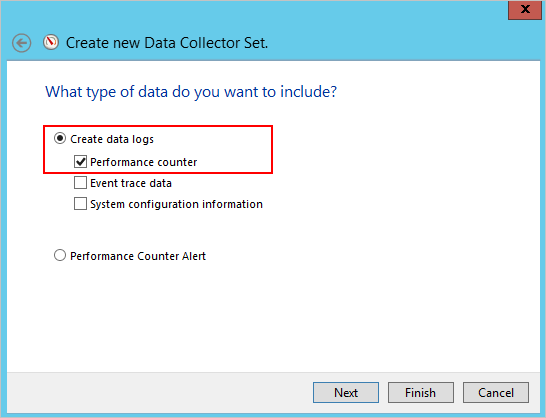

*Gäller för: Azure Advanced Threat Protection*

# Azure ATP-kapacitetsplanering
Den här artikeln hjälper dig att avgöra hur många Azure ATP sensorer och fristående sensorer som du behöver.

> [!NOTE] 
> Storleksverktyget har två blad - en för ATA och en för Azure ATP. Kontrollera att rätt bladet.

## Använda storleksverktyget
Det rekommenderade och enklaste sättet att avgöra kapaciteten för din Azure ATP-distribution är att använda den [Azure ATP Storleksverktyget](http://aka.ms/aatpsizingtool). Kör verktyget Azure ATP storlek och Använd följande fält från resultaten Excel-fil för att fastställa minne och CPU som används av sensor:

- Azure ATP sensor: matchar den **upptagna paket/sek** i Azure ATP sensor tabellen i resultatfilen med den **paket PER sekund** i den [Azure ATP fristående sensor tabell](#azure-atp-sensor-sizing)eller [Azure ATP sensor tabell](#azure-atp-standalone-sensor-sizing), beroende på den [sensor-typ du väljer](#choosing-the-right-sensor-type-for-your-deployment).

Om du inte kan använda Azure ATP-Storleksverktyget av någon anledning, manuellt samla in informationen om räknaren paket/sek från alla domänkontrollanter under 24 timmar med ett lågt insamlingsintervall (ca 5 sekunder). För varje domänkontrollant måste du sedan beräkna dagligt genomsnitt och genomsnitt för den mest hektiska perioden (15 minuter).
I följande avsnitt finns anvisningar om hur du samlar in information om paket/sek från en domänkontrollant.

## Välja rätt sensor-typ för distributionen
I en Azure ATP-distribution stöds valfri kombination av Azure ATP fristående sensor typer:

- Endast Azure ATP fristående sensorer
- Endast Azure ATP-temperatursensor
- En kombination av båda

När du bestämmer typen av sensor distribution, Överväg följande fördelar:

|typen av sensor|Fördelar|Kostnad|Distributionstopologi|Användning av domänkontrollant|
|----|----|----|----|-----|
|Azure ATP fristående sensor|Out-of-band-distribution gör det svårare för angripare att upptäcka Azure ATP finns|Högre|Installeras tillsammans med domänkontrollanten (out-of-band)|Har stöd för upp till 100 000 paket per sekund|
|Azure ATP-temperatursensor|Kräver inte en dedikerad server och portspeglingskonfiguration|Lägre|Installerad på domänkontrollanten|Har stöd för upp till 100 000 paket per sekund|

Tänk på följande när du bestämmer hur många Azure ATP fristående sensorer att distribuera.

-   **Active Directory-skogar och domäner** 
    Azure ATP kan övervaka trafik från flera domäner inom en Active Directory-skog för varje arbetsyta som du skapar. För att övervaka flera skogar, måste du skapa flera arbetsytor. 

-   **Portspegling** 
Överväganden för portspegling kan kräva att du kan distribuera flera Azure ATP fristående sensorer per data Datacenter eller avdelningskontor plats.

-   **Kapacitet** 
    En fristående Azure ATP-sensor har stöd för övervakning av flera domänkontrollanter, beroende på mängden nätverkstrafik för de domänkontrollanter som övervakas. 

## Azure ATP sensor och fristående sensor storlek 

En Azure ATP sensor har stöd för övervakning av en domänkontrollant baserat på mängden nätverkstrafik som domänkontrollanten genererar. I följande tabell är en uppskattning är det belopp som slutligen som Parsar sensorn beroende på hur mycket trafik som du har. 

|Paket per sekund *|CPU (kärnor)|Minne (GB)|
|----|----|-----|
|0-1 k|0.25|2.50|
|1k-5k|0.75|6.00|
|5k - 10k|1.00|6.50|
|10k - 20k|2.00|9.00|
|20k-50k|3.50|9.50|
|50k-75k |3.50|9.50|
|75k - 100k|3.50 |9.50|

> [!NOTE]
> - Totalt antal kärnor som den här domänkontrollanten har installerat. Vi rekommenderar att du inte arbetar med hypertrådade kärnor.
> - Total mängd minne som den här domänkontrollanten har installerat.
> -   Om domänkontrollanten inte har de resurser som krävs av Azure ATP sensorn domänkontrollantens prestanda genomförs inte, men Azure ATP-sensor kanske inte fungerar som förväntat.
> -   Vid körning som virtuell dator stöds inte dynamiskt minne och andra funktioner för ballongminne.
> -   För optimala prestanda ställer du in den **Energialternativ** av Azure ATP sensor till **högpresterande**.
> -   Minst 2 kärnor och 6 GB utrymme krävs och 10 GB rekommenderas, inklusive utrymme som krävs för Azure ATP-binärfiler.

## Beräkning av trafik för domänkontrollanter

Det finns flera olika verktyg du kan använda för identifiering av genomsnittligt antal paket per sekund för domänkontrollanterna. Om du inte har några verktyg som spårar räknaren kan du samla in informationen som krävs med hjälp av Prestandaövervakaren.

Fastställ antal paket per sekund genom att utföra följande steg på varje domänkontrollant:

1.  Öppna Prestandaövervakaren.

    

2.  Expandera **Datainsamlaruppsättningar**.

    

3.  Högerklicka på **Användardefinierade** och välj **Ny** &gt; **Datainsamlaruppsättning**.

    

4.  Ange ett namn på insamlaruppsättningen och välj **Skapa manuellt (avancerat)**.

5.  Under **Vilken typ av data vill du ta med?** väljer du **Skapa dataloggar och Prestandaräknare**.

    

6.  Under **Vilka prestandaräknare vill du logga?** klickar du på **Lägg till**.

7.  Expandera **Nätverkskort**, välj **Paket per sekund** och välj rätt instans. Om du inte är säker kan du välja **&lt;Alla instanser&gt;** och klicka på **Lägg till** och **OK**.

    > [!NOTE]
    > Om du vill utföra den här åtgärden på en kommandorad kör du `ipconfig /all` för att visa namnet på nätverkskortet och konfigurationen.

    

8.  Ändra den **provintervallet** till **fem sekunder**.

9. Ange den plats där du vill att data ska sparas.

10. Under **skapa datainsamlaruppsättningen**väljer **starta datainsamlaruppsättningen nu**, och klicka på **Slutför**.

    Nu bör du se datainsamlaruppsättningen som du skapade med en grön triangel som anger att den fungerar.

11. Efter 24 timmar stoppar du datainsamlaruppsättningen genom att högerklicka på datainsamlaruppsättningen och välja **Stoppa**.

    

12. Bläddra till den mapp där BLG-filen sparades i Utforskaren och dubbelklicka på den så att den öppnas i Prestandaövervakaren.

13. Välj räknaren Paket/s och anteckna genomsnittliga och högsta värden.

    

## Se även
- [Azure ATP-storleksverktyget](http://aka.ms/aatpsizingtool)
- [Krav för Azure ATP](atp-prerequisites.md)
- [Azure ATP-arkitektur](atp-architecture.md)
- [Ta en titt i ATP-forumet!](https://aka.ms/azureatpcommunity)
