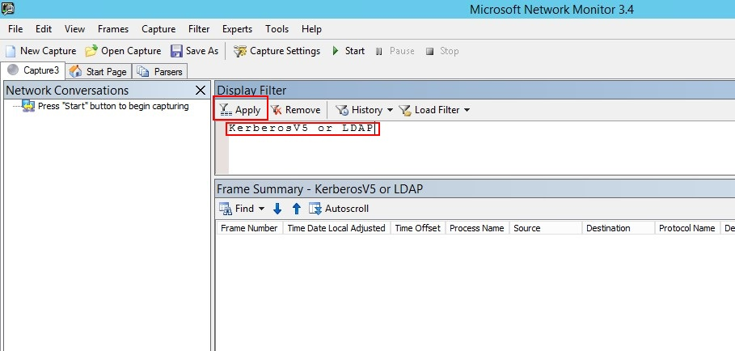
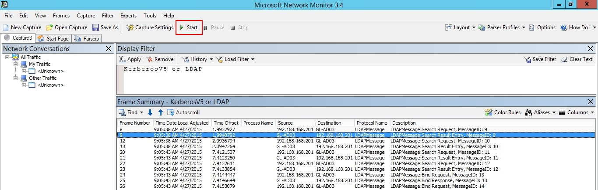

*Gäller för: Azure Avancerat skydd*

# Verifiera portspegling
> [!NOTE] 
> Den här artikeln är bara relevant om du distribuerar distribuera Azure ATP fristående sensorn i stället för Azure ATP-sensorn. För att avgöra om du behöver använda Azure ATP-sensorn, se [välja rätt sensorn för din distribution](atp-capacity-planning.md#choosing-the-right-sensor-type-for-your-deployment).
 
Följande steg vägleder dig genom processen för att verifiera att portspegling har konfigurerats korrekt. För Azure ATP ska fungera korrekt, kunna fristående Azure ATP-sensorn Se trafik till och från domänkontrollanten. Den huvudsakliga datakälla som används av Azure ATP är djup paketinspektion för nätverkstrafiken till och från domänkontrollanterna. För Azure ATP att se nätverkstrafiken måste portspegling vara konfigurerad. Portspegling kopierar trafiken från en port (källport) till en annan port (målport).

## Validera portspegling med Net Mon
1.  Installera [Microsoft Network Monitor 3.4](http://www.microsoft.com/download/details.aspx?id=4865) på fristående ATP-sensorn som du vill validera.

    > [!IMPORTANT]
    > Om du väljer att installera Wireshark för att verifiera portspegling, startar du om tjänsten Azure ATP fristående sensorn efter valideringen.

2.  Öppna Network Monitor och skapa en ny avbildningsflik.

    1.  Välj endast nätverkskortet att **avbilda** eller nätverkskortet som är anslutet till växelporten som har konfigurerats som portspeglingsmål.

    2.  Se till att P-Mode har aktiverats.

    3.  Klicka på **Ny avbildning**.

        

3.  I fönstret Visa filter anger du filtret **KerberosV5 OR LDAP** och klickar sedan på **Verkställ**.

    

4.  Klicka på **Starta** för att starta avbildningssessionen. Om du inte ser trafik till och från domänkontrollanten kontrollerar du konfigurationen av portspeglingen.

    

    > [!NOTE]
    > Det är viktigt att du kan se trafiken till och från domänkontrollanterna.
    

5.  Om du bara ser trafik i en riktning fungera med din nätverks- eller virtualiseringsteamen för att felsöka konfigurationen av portspeglingen.

## Se även

- [Konfigurera vidarebefordran](configure-event-forwarding.md)
- [Konfigurera portspegling](configure-port-mirroring.md)
- [Kolla in ATP-forumet!](https://aka.ms/azureatpcommunity)
